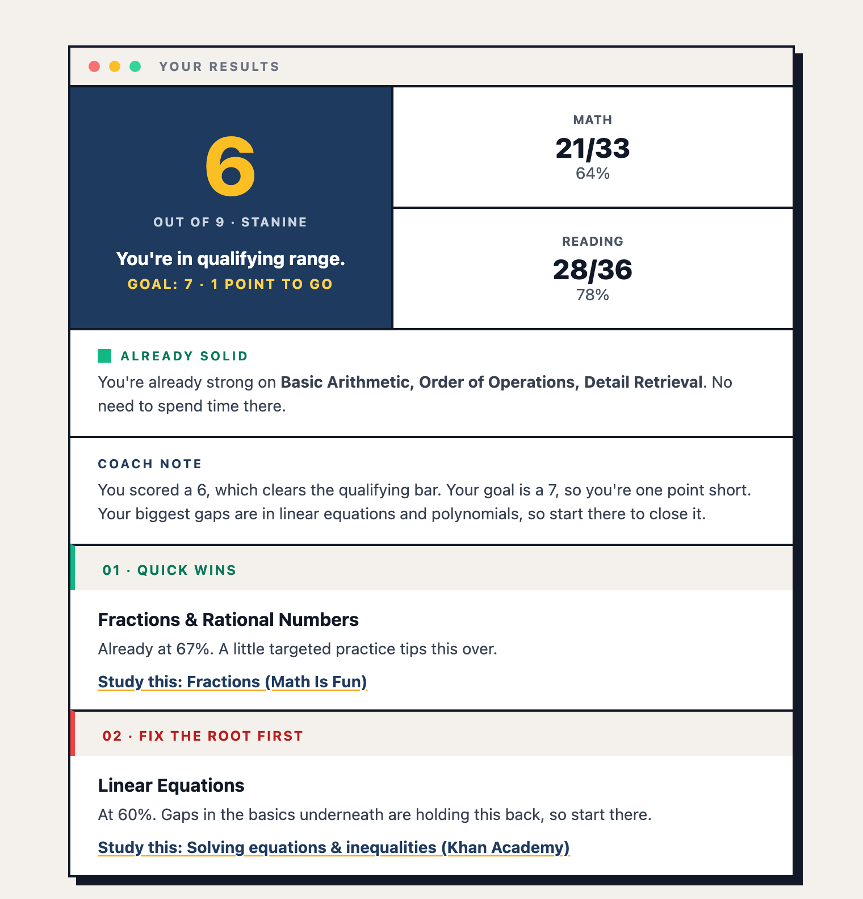
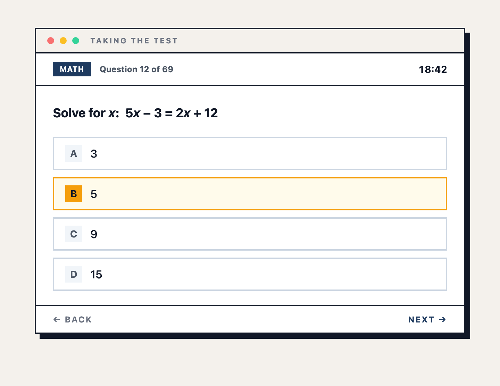
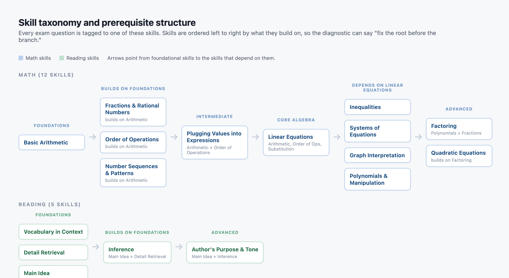
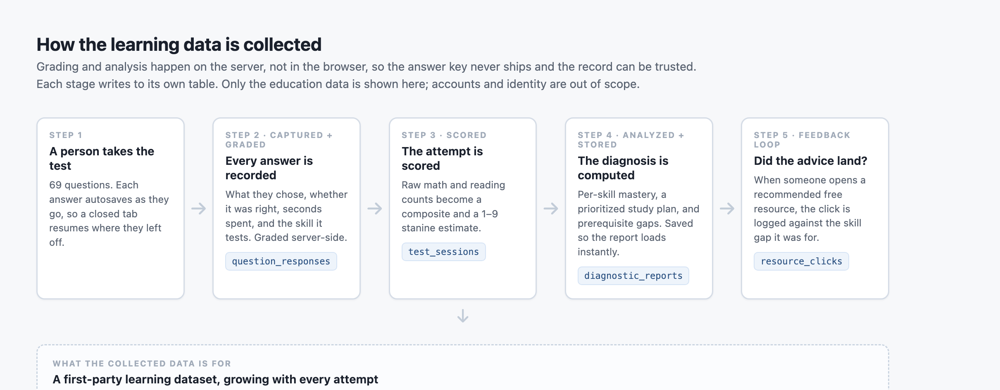

# VLTG

A free, full-length practice test and diagnostic for the electrical apprenticeship aptitude exam. Live at **[vltg.net](https://vltg.net)**.

Designed and built solo. This repository is a case study of the parts I am most proud of: how the exam was turned into a **skill map**, how the app turns a set of answers into a **specific diagnosis**, and the **learning data** collected along the way. The full application is private; this is the story of how it works, not the source code for it.

---

## The idea

Most practice tests hand you a score. A score tells you *that* you are behind. It does not tell you *on what*.

The thing I have seen over and over, from years of tutoring, is that people misdiagnose themselves. Someone gets two algebra questions wrong and concludes "I am bad at algebra." Usually they are not. They are bad at *fractions*, and the fractions were hiding inside the algebra. Those are different problems, and they take different amounts of time to fix.

VLTG is built to find the *specific* thing. You take the real test, and instead of a number you get a map of what is actually holding your score back, ordered by what to fix first.

## What it produces

At the end of the test, a person sees their standing and a plan, not just a grade:

The test itself mirrors the real exam's structure and clock:

---

## Curriculum design

The core design decision is that the exam is not one subject. It is a set of **skills that build on each other**, and the diagnostic is only as good as that map.

Every question in the bank is tagged to exactly one skill. Each skill records what it **builds on**. That prerequisite structure is what lets the study plan reason about root causes instead of just listing weak spots.

Read left to right, this is also the order to *learn* things in. If a person is weak on Linear Equations and also weak on the Arithmetic underneath it, sending them to practice linear equations is a waste. The plan sends them to the foundation first, because fixing the root usually lifts everything above it.

The structure, expressed in code: **[`snippets/skill-taxonomy.ts`](snippets/skill-taxonomy.ts)**. (The questions themselves are not in this repo.)

A few design choices worth calling out:

- **Original questions, matched to the published structure of the real exam.** The real exam's items are secured, so no one outside the test maker has them. Writing original questions was the only honest option.
- **Every math answer is checked by code before it ships.** A wrong answer key is the most damaging thing a practice test can do, because a person walks away believing the wrong thing about themselves.
- **Each skill gap maps to a specific free resource.** The plan does not just say "study fractions." It links a good, free place to start on fractions.

---

## The learning data

This is the part I find most interesting, and it is the reason the product exists in the first place: I wanted to build something that generates its own fresh, first-hand data. I have worked with a lot of education data, and most of it is stale and second-hand. This collects its own.

Everything below is education data only. How accounts and identity work is deliberately left out of this writeup, and in the schema the learner is shown as an opaque reference with no personal fields.

Four tables carry the learning data. In plain terms:

- **Every answer, as it happens** (`question_responses`). For each question: what the person chose, whether it was right, how many seconds they spent, and which skill it tests. This is the raw material for everything else. Grading happens on the server, so "was it right" can be trusted and the answer key never reaches the browser.
- **Each attempt's outcome** (`test_sessions`). One row per completed test: the raw math and reading counts, the composite, and the 1 to 9 estimate.
- **The computed diagnosis** (`diagnostic_reports`). The per-skill breakdown, the ordered study plan, and the prerequisite gaps, stored once so the report loads instantly instead of being recomputed on every visit.
- **Whether the advice worked** (`resource_clicks`). When someone opens a recommended free resource, the click is logged against the *skill gap* it was for. This closes the loop: it shows whether the diagnosis actually changes what people go study.

The tables, sanitized: **[`snippets/education-schema.sql`](snippets/education-schema.sql)**.

Why collect all of this? Three reasons, and each one gets better as more people take the test:

1. **Calibration.** The official tables that convert a raw score to the 1 to 9 scale are not public. Real score distributions let the estimate get sharper over time.
2. **Curriculum signal.** Which skills are hardest across everyone, and which prerequisites turn out to be the real blocker most often.
3. **Did it work.** Resource clicks by skill gap point to where a linked resource is not enough and original material is worth building.

---

## Scoring and measurement

Turning a set of right-and-wrong answers into a useful diagnosis is three moves: score the whole test, find the weak skills, then order them into a plan.

The scoring is deliberately **honest about its own limits**. The 1 to 9 stanine is a standing-relative-to-others scale, and the real exam's norming tables are not public. So the score is a documented estimate under a clear model, and the app says exactly that rather than implying a precision it does not have. Volunteering the limits of your own measurement is, to me, the difference between an analyst and a dashboard.

The prioritization logic (score to stanine, per-skill accuracy, then a prerequisite-aware plan) is here, sanitized: **[`snippets/diagnostic-scoring.ts`](snippets/diagnostic-scoring.ts)**.

The plan sorts gaps by leverage: shaky foundations and prerequisites first, then quick wins that are close to passing, then harder stretch topics last.

---

## Engineering, briefly

The rest of the stack, in one paragraph: **Next.js** (App Router, TypeScript) and **Tailwind** on the front end, **Supabase** (Postgres) for data with access rules enforced on the server so a person can only ever reach their own results, an **Anthropic** model for a short written coaching note, and **Vercel** for hosting. Answers autosave as you go, so a closed tab resumes exactly where it left off.

## Status

Live and early. It is being found through organic search for real applicant questions, and the honest calibration work described above is ongoing as more people take it.

## Disclaimer

VLTG is an independent practice tool. It is not affiliated with, endorsed by, or connected to the IBEW, NECA, or the electrical Training ALLIANCE. Those names are used only to describe the exam this test helps people prepare for.
